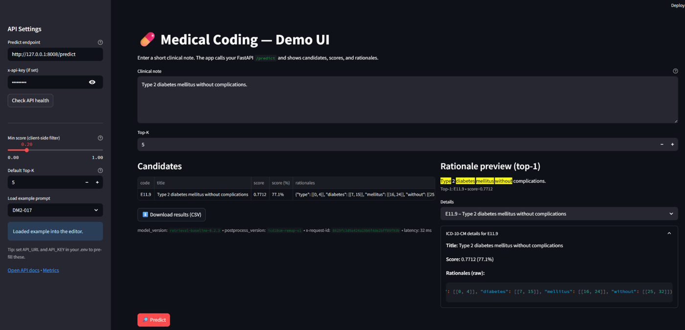

# Medical Coding Automation

**What it is:** ICD-10-CM coding assistant: suggest codes from a clinical note with **rationale highlights**, **negation handling**, and **billing-aware** post-processing.  
**Stack:** FastAPI backend, Streamlit UI, TF-IDF retrieval over an **enriched codebook**, Prometheus metrics, tests + regression pack.



## How it works

1. **Sectionize** the note (Assessment/Plan weighted).
2. **Expand abbreviations** (e.g., LBP→low back pain, HTN→hypertension).
3. Retrieve with **TF-IDF** over code titles + synonyms + includes.
4. **Negation** suppression (e.g., “denies pneumonia”).
5. **Post-process** to **billable** child codes (e.g., M54.5 → M54.50/51/59).
6. Return candidates with **rationale spans** + version metadata; expose **/metrics**.

## Try it locally

```powershell
# Terminal 1 – API
python -m uvicorn services.coder_api.app:app --host 0.0.0.0 --port 8008 --proxy-headers

# Terminal 2 – UI
python -m streamlit run ui/streamlit_review.py --server.port 8501
```

Open http://localhost:8501 and set Predict endpoint to `http://127.0.0.1:8008/predict`.

## Demo prompts

- "Low back pain, denies pneumonia." → LBP code; **no** J18.9
- "Vertebrogenic low back pain." → **M54.51**
- "HTN and T2DM, stable on meds." → **I10**, **E11.9**
- "Pain in left knee." → **M25.562**
- "Type 2 diabetes mellitus without complications." → **E11.9**

## Notes

- `.env`: `API_KEY`, `MIN_SCORE`, `CORS_ORIGINS`, optional `CODEBOOK_PATH` (enriched CSV).
- Regression examples available via sidebar dropdown when `REGRESSION_CSV` is set.
- Roadmap: BM25/embeddings, laterality/episode rules, expanded evaluation set.
